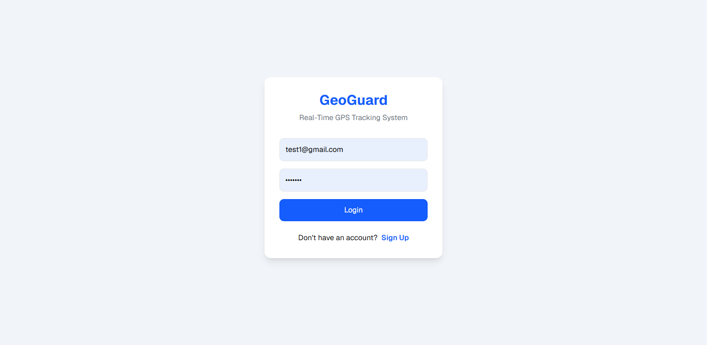
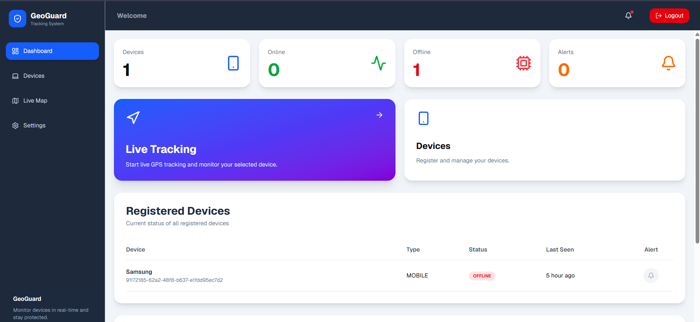
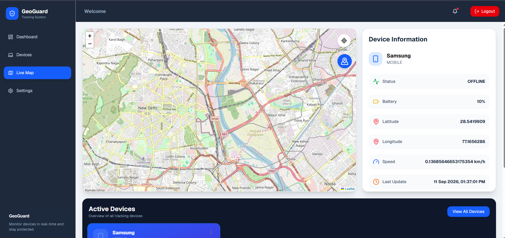

# GeoGuard

## Real-Time Geofencing & Live Device Tracking System

GeoGuard is a real-time geofencing and live device tracking system designed to monitor device locations and manage geographical boundaries efficiently.

### Screenshot








### Features

- Real-time device location tracking
- Geofencing support
- Live location monitoring
- Interactive maps
- Secure backend API integration
- User authentication and authorization

### Technology Stack

**Frontend**

- React
- Vite
- Leaflet

**Backend**

- Spring Boot
- PostgreSQL
- AWS

### Getting Started

Install dependencies:

```bash
npm install
```

Run the development server:

```bash
npm run dev
```

Build for production:

```bash
npm run build
```
